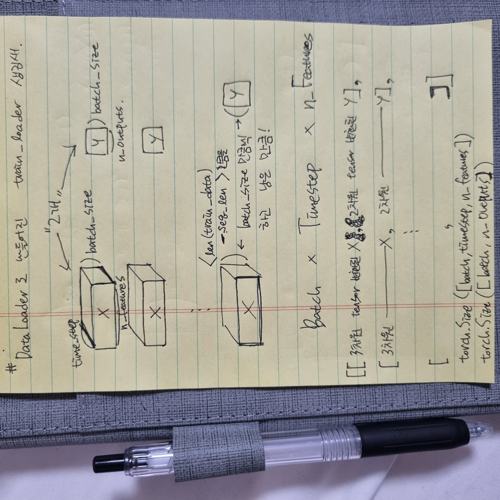

<!-- # CustomDataset

<br>
<br>

# DataLoader
 -->

## Torch Flow 중...
<p align="center">
  
  
  <figcaption align="center">CustomDataset | DataLoader</figcaption>
</p>

## 가장 일반적인 CustomDataset code
```python
class CustomDataset(Dataset):
    def __init__(self, X, Y):
        self.X = X
        self.Y = Y

    def __getitem__(self, index):
        ## train
        if self.Y is not None:
            return torch.Tensor(self.X[index]), torch.Tensor(self.Y[index])
        ## test
        else:
            return torch.Tensor(self.X[index])

    def __len__(self):
        return len(self.X)
```
<br>

사용방법 <br>
```python
train_dataset = CustomDataset(train_x, train_y)
train_loader = DataLoader(train_dataset, batch_size = CFG['BATCH_SIZE'], shuffle=True, num_workers=0)
```
<br>


[.md img 삽입](https://dlee0129.tistory.com/46) <br>
[gitingore](https://nesoy.github.io/articles/2017-01/Git-Ignore) <br>
[.md 이미지 정렬](https://chanyoung-dev.github.io/Blog/Markdown/imageAlign/) <br>
